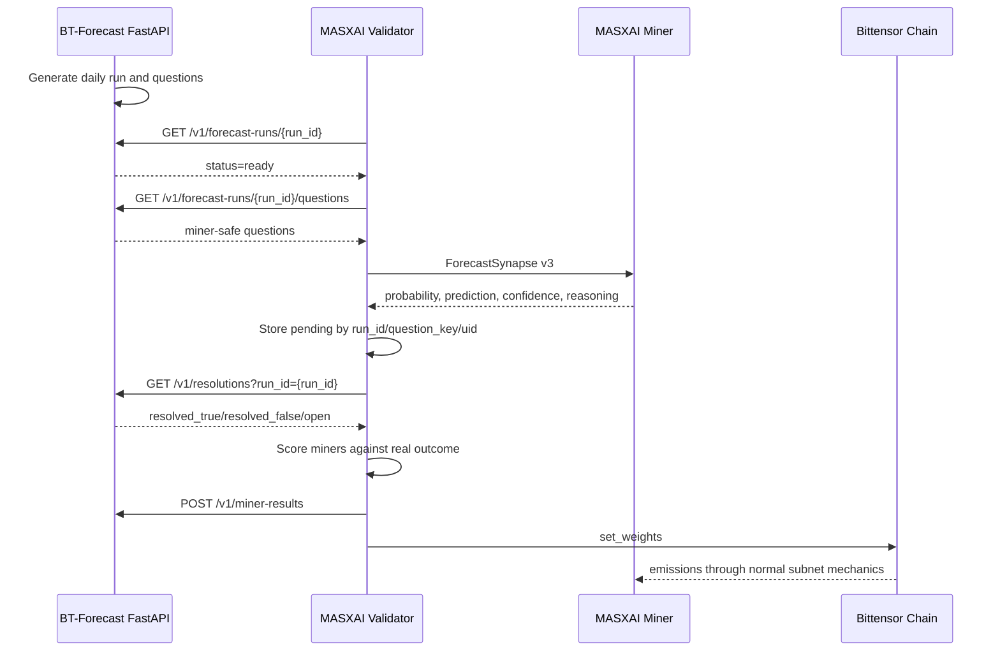

# MASXAI Subnet and BT-Forecast Flow

This document explains how the MASXAI Bittensor subnet works with the centralized
BT-Forecast FastAPI service, and how the same lifecycle works with local mock
data.

## Actors

There are three main actors.

| Actor | Runs where | Responsibility |
| --- | --- | --- |
| BT-Forecast service | Central FastAPI service | Creates forecast questions, stores benchmark fields privately, resolves outcomes later, receives accurate miner feedback. |
| Validator | MASXAI subnet | Fetches questions from BT-Forecast, sends miner-safe tasks to miners, stores pending answers, resolves outcomes, scores miners, and sets weights. |
| Miner | MASXAI subnet | Receives a `ForecastSynapse` from validators and returns its own probability forecast. |

Important rule:

```text
Miners never call BT-Forecast.
Only validators call BT-Forecast.
```

## Runtime Files

The live Bittensor neuron path is:

| File | Purpose |
| --- | --- |
| `neurons/validator.py` | Main validator issue, resolve, score, feedback, and weight flow. |
| `neurons/miner.py` | Main miner axon flow. Receives `ForecastSynapse` and returns forecast fields. |
| `masxai/protocol.py` | `ForecastSynapse` v3 wire schema. |
| `masxai/oracle_bt.py` | BT-Forecast FastAPI client. |
| `masxai/scoring.py` | Brier skill, calibration, consistency, timeliness, EMA scoring. |
| `scripts/mock_run.py` | Local no-chain mock run for the subnet validator loop. |
| `tests/test_bt_forecast_integration.py` | Mock BT-Forecast integration test. |

## Environment

Use `BT_FORECAST_*` for the central FastAPI service.

```env
BT_FORECAST_BASE_URL=https://your-bt-forecast-api.example
BT_FORECAST_API_KEY=validator-api-key
BT_FORECAST_API_SECRET=validator-api-secret
BT_FORECAST_BEARER_TOKEN=
BT_FORECAST_RUN_ID=
BT_FORECAST_RUN_DATE=
BT_FORECAST_INCLUDE_LINEAGE=false
BT_FORECAST_TIMEOUT=10
BT_FORECAST_MAX_RETRIES=3

MASXAI_BT_FORECAST_REQUIRED=false
MASXAI_BT_FORECAST_MAX_QUESTIONS_PER_ROUND=12
MASXAI_BT_FORECAST_REISSUE_SECONDS=0
MASXAI_BT_FORECAST_RESOLUTION_WAIT_SECONDS=432000
MASXAI_BT_FORECAST_FEEDBACK_THRESHOLD=0.10
MASXAI_QUERY_VALIDATOR_UIDS=false
MASXAI_REQUIRE_VALIDATOR_PERMIT=false
```

`PRIVATEBT_*` was an older name for the same private BT-Forecast backend. New
deployments should use `BT_FORECAST_*`.

## Central BT-Forecast Flow

### Step 1 - BT-Forecast builds a daily run

BT-Forecast creates a run such as:

```text
run_id = bt-2026-07-21
```

The validator can use:

```env
BT_FORECAST_RUN_ID=bt-2026-07-21
```

or:

```env
BT_FORECAST_RUN_DATE=2026-07-21
```

If neither is set, the validator uses today's UTC-style run id:

```text
bt-YYYY-MM-DD
```

### Step 2 - Validator polls the run

Request:

```http
GET /v1/forecast-runs/bt-2026-07-21
```

Example response:

```json
{
  "run_id": "bt-2026-07-21",
  "status": "ready",
  "ready_at": "2026-07-21T07:11:22Z",
  "question_count": 12,
  "template_version": "t2",
  "measurement_version": "m3"
}
```

If the status is not `ready`, the validator waits and tries again later.

### Step 3 - Validator fetches miner-safe questions

Request:

```http
GET /v1/forecast-runs/bt-2026-07-21/questions
```

Example response:

```json
{
  "run_id": "bt-2026-07-21",
  "questions": [
    {
      "question_id": "5f3c-example",
      "question_key": "active_miners|SN12|2026-08-04",
      "question": "Will SN12 active miner count fall below 128 by 2026-08-04?",
      "family": "active_miners",
      "scope": "subnet",
      "netuid": 12,
      "horizon_days": 14,
      "generated_at": "2026-07-21T07:11:22Z",
      "cutoff_date": "2026-08-04T06:00:00Z",
      "resolution_criteria": "Resolved from the 2026-08-04 daily on-chain snapshot.",
      "evidence_summary": "SN12 active miners moved from 141 to 133 over 7 days.",
      "measurement": {
        "source": "daily_snapshot",
        "grade_time_utc": "06:00",
        "threshold": 128,
        "threshold_unit": "miners",
        "operator": "below"
      }
    }
  ]
}
```

Miner-safe questions must not include:

```text
engine_probability
anchor_probability
chain_probability
llm_probability
```

Those are validator-only benchmark fields and must never go to miners.

### Step 4 - Validator creates a ForecastSynapse

The validator converts the BT-Forecast question into a subnet message.

Validator to miner:

```json
{
  "forecast_id": "issue-abc123",
  "question_id": "5f3c-example",
  "question_key": "active_miners|SN12|2026-08-04",
  "question": "Will SN12 active miner count fall below 128 by 2026-08-04?",
  "event_type": "significant_bittensor_event",
  "family": "active_miners",
  "scope": "subnet",
  "netuid": 12,
  "horizon_days": 14,
  "issued_at": 1784700000.0,
  "resolve_at": 1785823200.0,
  "context": "SN12 active miners moved from 141 to 133 over 7 days.\nResolved from the 2026-08-04 daily on-chain snapshot.",
  "version": 3
}
```

This is sent through Bittensor dendrite to miner axons.

### Step 5 - Miner returns its forecast

Miner to validator:

```json
{
  "forecast_id": "issue-abc123",
  "probability": 0.78,
  "prediction": true,
  "confidence": 0.78,
  "reasoning": "The miner count trend is falling and neighboring subnet demand is rising.",
  "model": "miner-custom-model-v1",
  "features": {
    "active_miners_delta_7d": -8,
    "emission_share_trend": "down"
  },
  "timestamp": "2026-07-21T07:15:11Z"
}
```

`probability` is the primary scoring field.

### Step 6 - Validator stores the answer as pending

The validator stores one active pending row per:

```text
(run_id, question_key, uid)
```

Example logical key:

```text
bt-2026-07-21 + active_miners|SN12|2026-08-04 + uid 17
```

Example pending record:

```json
{
  "source": "bt_forecast",
  "uid": 17,
  "hotkey": "5F...",
  "run_id": "bt-2026-07-21",
  "question_id": "5f3c-example",
  "question_key": "active_miners|SN12|2026-08-04",
  "family": "active_miners",
  "scope": "subnet",
  "netuid": 12,
  "horizon_days": 14,
  "probability": 0.78,
  "prediction": true,
  "confidence": 0.78,
  "reasoning": "The miner count trend is falling and neighboring subnet demand is rising.",
  "model": "miner-custom-model-v1",
  "issued_at": 1784700000.0,
  "submitted_at": 1784700911.0,
  "resolve_at": 1785823200.0,
  "cutoff_date": "2026-08-04T06:00:00Z"
}
```

### Step 7 - Validator waits until cutoff

BT-Forecast questions resolve in days, not in one hour.

Typical horizons:

```text
7 days
14 days
30 days
```

The validator keeps the miner forecasts pending until `resolve_at`.

### Step 8 - Validator fetches real outcomes

Request:

```http
GET /v1/resolutions?run_id=bt-2026-07-21
```

Example resolved response:

```json
{
  "resolutions": [
    {
      "question_key": "active_miners|SN12|2026-08-04",
      "status": "resolved_true",
      "outcome": true,
      "cutoff_date": "2026-08-04T06:00:00Z",
      "resolved_at": "2026-08-04T06:04:10Z",
      "measurement_value": 126,
      "engine_brier": 0.096,
      "deferral_reason": null
    }
  ]
}
```

Example deferred response:

```json
{
  "resolutions": [
    {
      "question_key": "active_miners|SN12|2026-08-04",
      "status": "open",
      "outcome": null,
      "deferral_reason": "daily snapshot not available yet"
    }
  ]
}
```

If the status is `open`, the validator waits up to:

```env
MASXAI_BT_FORECAST_RESOLUTION_WAIT_SECONDS=432000
```

That is 5 days.

Terminal unscored statuses are dropped:

```text
expired
annulled
ambiguous
rejected
```

### Step 9 - Validator scores miners against reality

The validator scores each miner against the real outcome:

```text
outcome = true
```

Example miner forecasts:

| Miner uid | Probability | Prediction | Outcome | Result |
| --- | ---: | --- | --- | --- |
| 17 | 0.93 | YES | true | Strong score |
| 22 | 0.78 | YES | true | Good score |
| 31 | 0.40 | NO-ish | true | Weak score |
| 44 | 0.50 | Neutral | true | Baseline, near zero with baseline gate |

The score uses:

```text
50% Brier skill vs baseline
20% confidence calibration
20% historical consistency
10% timeliness
```

The validator then updates:

```text
self.scores[uid] = EMA(previous_score, reward)
```

### Step 10 - Validator sets Bittensor weights

The validator weight path uses the normal Bittensor subnet mechanism.

```text
miner forecast
-> delayed resolution
-> validator reward
-> self.scores
-> normalized weights
-> set_weights
-> Yuma consensus
-> miner emissions
```

Miners are not paid per HTTP call. They receive emissions through the normal
Bittensor weight and consensus loop.

### Step 11 - Validator sends accurate miners back to BT-Forecast

After a question resolves, the validator sends accurate miner forecasts back to
BT-Forecast for calibration.

Request:

```http
POST /v1/miner-results
```

Example body:

```json
{
  "run_id": "bt-2026-07-21",
  "question_key": "active_miners|SN12|2026-08-04",
  "family": "active_miners",
  "scope": "subnet",
  "netuid": 12,
  "horizon_days": 14,
  "outcome": true,
  "measurement_value": 126,
  "resolved_at": "2026-08-04T06:04:10Z",
  "engine_probability": 0.31,
  "results": [
    {
      "uid": 17,
      "hotkey": "5F...",
      "probability": 0.93,
      "prediction": true,
      "confidence": 0.93,
      "reasoning": "Miner count was falling faster than the daily baseline.",
      "model": "miner-custom-model-v1",
      "features": {
        "active_miners_delta_7d": -8
      },
      "issued_at": 1784700000.0,
      "submitted_at": 1784700911.0,
      "brier": 0.0049,
      "dist_to_outcome": 0.07,
      "dist_to_engine": 0.62
    }
  ]
}
```

Only miners within the feedback threshold are included:

```env
MASXAI_BT_FORECAST_FEEDBACK_THRESHOLD=0.10
```

This feedback is for BT-Forecast calibration. It is not the emission gate.

## Sequence Diagram



## Local Mock Subnet Flow

Use:

```bash
python3 scripts/mock_run.py
```

This does not need:

```text
real Bittensor chain
real wallets
real BT-Forecast API
real miners
```

It creates a local mock network and exercises the validator loop.

Mock actors:

| Mock actor | Behavior |
| --- | --- |
| Mock validator | Uses the real validator logic. |
| Mock metagraph | Pretends there are serving miners. |
| Mock miners | Return fixed strategy forecasts. |
| Mock oracle | Resolves a simulated outcome. |

Example mock miner strategies:

| UID | Strategy | Example behavior |
| --- | --- | --- |
| 1 | Bullish | Returns YES with probability around 0.72. |
| 2 | Bearish | Returns NO with probability around 0.28. |
| 3 | Baseline | Returns neutral probability 0.50. |
| 4 | Flaky | Sometimes answers, sometimes does not. |

Mock flow:

```text
1. Validator creates a local TAO price question.
2. Mock miners return forecasts.
3. Validator stores all answers as pending.
4. Mock price oracle resolves the outcome.
5. Validator scores each miner.
6. Scores are normalized into mock weights.
```

Example output shape:

```text
FINAL LEADERBOARD

uid  strategy          score(EMA)    weight
---  ----------------  ----------  --------
1    bullish(0.72)     0.1127      0.6992
4    flaky/no-answer   0.0485      0.3008
2    bearish(0.28)     0.0000      0.0000
3    baseline(0.50)    0.0000      0.0000
```

This proves:

```text
issue -> miner response -> pending -> resolve -> score -> weight
```

## Mock BT-Forecast Integration Flow

The integration test uses a fake BT-Forecast client and fake miners.

Use:

```bash
python3 -m pytest tests/test_bt_forecast_integration.py -q
```

Mock BT-Forecast run:

```json
{
  "run_id": "bt-test",
  "status": "ready",
  "question_count": 1
}
```

Mock BT-Forecast question:

```json
{
  "question_id": "pred-1",
  "question_key": "active_miners|SN12|2099-01-01",
  "question": "Will SN12 active miner count fall below 128 by 2099-01-01?",
  "family": "active_miners",
  "scope": "subnet",
  "netuid": 12,
  "horizon_days": 14,
  "cutoff_date": "2099-01-01T06:00:00Z",
  "engine_probability": 0.31
}
```

The validator can see `engine_probability` only when lineage is enabled, but the
miner synapse does not include it.

Mock miner responses:

```json
[
  {
    "uid": 1,
    "probability": 0.93,
    "prediction": true,
    "confidence": 0.93
  },
  {
    "uid": 2,
    "probability": 0.40,
    "prediction": false,
    "confidence": 0.60
  }
]
```

Mock resolution:

```json
{
  "question_key": "active_miners|SN12|2099-01-01",
  "status": "resolved_true",
  "outcome": true,
  "measurement_value": 126
}
```

Expected behavior:

```text
uid 1 gets a stronger score than uid 2.
Only uid 1 is posted back to /v1/miner-results.
The miner synapse never contains engine_probability=0.31.
```

## Privacy and Open-Source Rules

The open-source subnet should reveal only the public miner task.

Safe to send to miners:

```text
question
question_key
family
scope
netuid
horizon_days
cutoff/resolve time
neutral evidence
resolution criteria
measurement description
```

Do not send to miners:

```text
engine_probability
anchor_probability
chain_probability
llm_probability
predetermined_at_creation lineage data
internal calibration parameters
private service credentials
```

Default:

```env
BT_FORECAST_INCLUDE_LINEAGE=false
```

That is the recommended open-source setting.

## Summary

```text
BT-Forecast creates and resolves questions.
Validator fetches questions and outcomes from BT-Forecast.
Validator sends only miner-safe ForecastSynapse tasks to miners.
Miners return independent probability forecasts.
Validator stores forecasts as pending until the outcome is known.
Validator scores miners against the real outcome.
Validator sets Bittensor weights from miner scores.
Validator sends accurate miner forecasts back to BT-Forecast for calibration.
```

